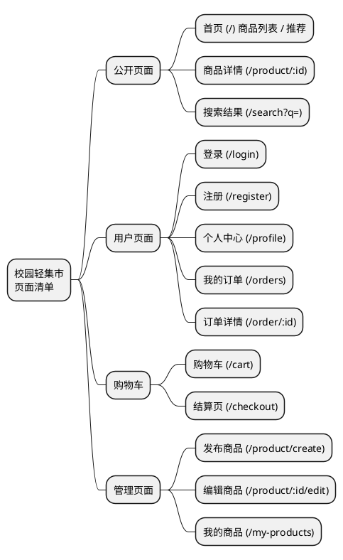
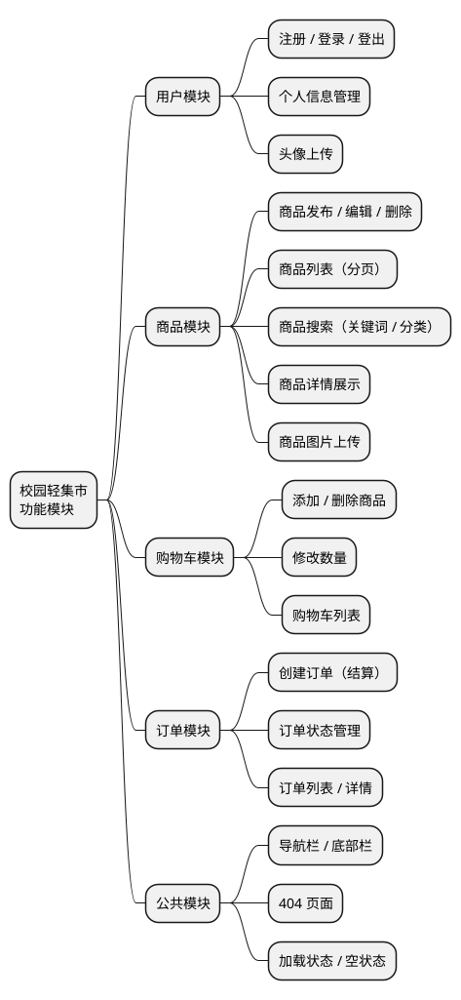

# 校园轻集市 —— 项目规划

> 基于"校园轻集市"需求分析，对项目进行整体规划。

---

## 一、页面清单



| 页面 | 路由 | 说明 |
|------|------|------|
| 首页 | `/` | 商品列表、推荐、搜索入口 |
| 商品详情 | `/product/:id` | 查看商品详细信息 |
| 搜索结果 | `/search` | 按关键词/分类搜索商品 |
| 登录 | `/login` | 用户登录 |
| 注册 | `/register` | 用户注册 |
| 个人中心 | `/profile` | 查看/编辑个人信息 |
| 我的订单 | `/orders` | 查看订单列表 |
| 订单详情 | `/order/:id` | 查看单笔订单详情 |
| 购物车 | `/cart` | 购物车管理 |
| 结算 | `/checkout` | 提交订单 |
| 发布商品 | `/product/create` | 发布新商品 |
| 编辑商品 | `/product/:id/edit` | 编辑已有商品 |
| 我的商品 | `/my-products` | 管理自己发布的商品 |

---

## 二、功能模块



### 模块职责矩阵

| 模块 | 涉及页面 | Store | API | 组件 |
|------|---------|-------|-----|------|
| 用户 | 登录、注册、个人中心 | `useUserStore` | `api/user.ts` | `NavBar`, `UserAvatar` |
| 商品 | 首页、详情、搜索、发布 | `useProductStore` | `api/product.ts` | `ProductCard`, `ProductForm` |
| 购物车 | 购物车 | `useCartStore` | `api/cart.ts` | `CartItem`, `CartSummary` |
| 订单 | 订单列表、详情、结算 | `useOrderStore` | `api/order.ts` | `OrderCard`, `OrderStatus` |
| 公共 | 全局 | — | — | `NavBar`, `Footer`, `Loading` |

---

## 三、开发顺序

```plantuml
@startgantt
[用户模块] lasts 3 days
[商品模块] lasts 4 days
[购物车模块] lasts 2 days
[订单模块] lasts 3 days
[公共模块] lasts 1 day
[集成联调] lasts 2 days
[用户模块] starts at 0
[商品模块] starts at 2
[购物车模块] starts at 5
[订单模块] starts at 6
[公共模块] starts at 0
[集成联调] starts at 8
@endgantt
```

| 阶段 | 任务 | 天数 | 里程碑 |
|------|------|------|--------|
| **Phase 1** | 项目初始化 + 公共组件 + 路由框架 | 1 天 | 项目骨架搭建完成 |
| **Phase 2** | 用户模块（注册/登录/个人中心） | 2 天 | 用户可注册登录 |
| **Phase 3** | 商品模块（列表/详情/搜索/发布） | 3 天 | 商品可浏览和发布 |
| **Phase 4** | 购物车模块 | 2 天 | 购物车功能可用 |
| **Phase 5** | 订单模块（结算/订单管理） | 2 天 | 完整交易闭环 |
| **Phase 6** | 集成联调 + 优化 | 2 天 | 全功能可用 |

**依赖关系说明**：
- 用户模块是基础 → 先于购物车、订单
- 商品模块独立开发但与用户模块并行
- 购物车依赖用户登录态和商品数据
- 订单依赖购物车和用户

---

## 四、开发重点

### 1. 路由与导航设计
- 使用 **路由守卫** 实现未登录拦截（购物车、订单、个人中心）
- 登录/注册页面应重定向回来源页
- 404 页面兜底

### 2. 状态管理策略
- `useUserStore`：token、用户信息、登录状态
- `useCartStore`：购物车数据持久化（localStorage 配合 API）
- `useProductStore`：商品列表缓存与搜索参数管理

### 3. 组件复用
- `ProductCard`：首页列表、搜索结果、我的商品三处复用
- 全局 Loading / Empty / Error 状态组件统一
- 表单组件统一校验逻辑

### 4. API 层设计
- 统一 `request.ts` 封装 axios，处理 token 注入和 401 自动跳转
- 按模块拆分 `api/user.ts`、`api/product.ts`、`api/cart.ts`、`api/order.ts`

### 5. 用户体验
- 列表页：分页加载 + 下拉刷新
- 商品详情：图片轮播
- 表单：即时校验 + 提交防抖
- 空状态引导提示（购物车为空、订单为空等）

---

## 五、技术架构概览

```
┌─────────────────────────────────────────────┐
│                   Views                      │
│   Home  Detail  Search  Cart  Profile  ...   │
├───────────────┬─────────────────────────────┤
│   Components  │        Router (guard)        │
│  ProductCard  │  /  /product/:id  /cart ...  │
│  NavBar       │                              │
│  Loading      │                              │
├───────────────┴─────────────────────────────┤
│               Pinia Stores                   │
│  useUser  useProduct  useCart  useOrder      │
├─────────────────────────────────────────────┤
│                API Layer                     │
│  user.ts  product.ts  cart.ts  order.ts     │
│  request.ts (axios + interceptors)          │
└─────────────────────────────────────────────┘
```
